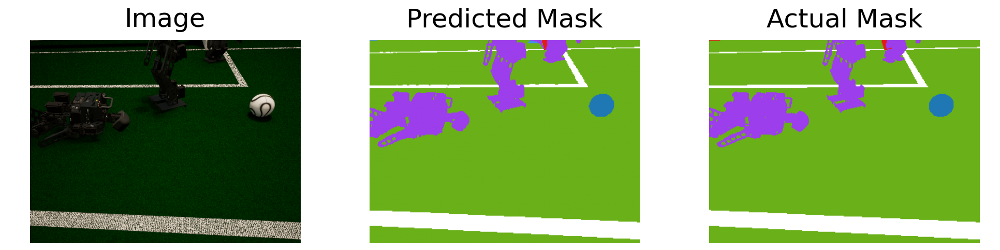
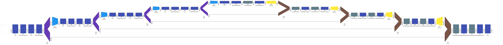

# Semantic segmentation on a soccer field for humanoid robots

> ENEL 645 Project
> 
> University of Calgary 
> 
> Course Instructor: Roberto Medeiros de Souza

| Team \#      | 11                                                   |
| ------------ | ---------------------------------------------------- |
| Student Name | [Amir Gholami](https://github.com/AmiirGholamii)     |
| Student Name | [Pegah Behvarmanesh](https://github.com/PegahBehvar) |
| Student Name | [Ahmadreza Nazari](https://github.com/ahmadreza-n)   |

## Introduction
This projects aims to perform semantic segmentation on a soccer field for humanoid robots. Image segmentation is task of training a neural network to output a pixel-wise mask of the image. In contrast with classification in which we only output a label for the whole image, segmentation helps in understanding the image at a much lower level, i.e., the pixel level. An example of image segmentation is shown in the following figure, where the purple, blue, green, white, and red color represent robots, the ball, field, field lines, and the goal respectively.

## Dataset
The main dataset used to train the main network is generated using [Unreal Engine](https://www.unrealengine.com/). This dataset is composed of 10,000 images along with their true masks (pixel-wise labels). In order to evaluate the model for real a use case, we have to evaluate the network with real images taken from different robotic events. For this purpose, we used [Hasty.AI](https://hasty.ai/) to manually generate masks for 250 real images.

## Neural Network
The architecture employed is the [U-NET](https://arxiv.org/abs/1505.04597). U-NET is a fully convolutional auto-encoder, which is widely used for similar purposes (i.e. segmentation). The following diagram depicts the architecture of the network.

*Diagrams were generated using a [Net2Vis](https://arxiv.org/abs/1902.04394v1?source=post_page---------------------------).*

## Usage
1. First install the required libraries.
2. Run [enel645_group11_final_project.py](./enel645_group11_final_project.py) to train the model using simulated data.
3. Run the [transfer_learning.py](./transfer_learning.py) to modify the weights for real images.

**For both simulation and real data, some figures will be saved into results directory for visual assessment**
